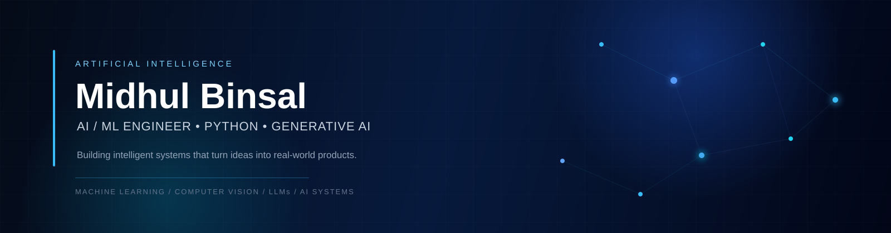

<div align="center">



<br/>

<a href="https://midhulbinsal.dev">

</a>

<a href="https://www.linkedin.com/in/midhulbinsal/">

</a>

<a href="https://github.com/Midhull">

</a>

<br/><br/>


</div>

---

## About

I'm **Midhul Binsal**, an **AI/ML Engineer** focused on building practical artificial intelligence systems and intelligent software products.

My primary focus is **Python-based AI/ML engineering**, with interests across:

- Machine Learning
- Deep Learning
- Generative AI
- Large Language Models
- Retrieval-Augmented Generation
- Computer Vision
- Natural Language Processing
- AI Agents
- Intelligent Automation

I enjoy taking projects beyond experimentation:

```text
Problem
   ↓
Data
   ↓
Model
   ↓
AI System
   ↓
API
   ↓
Product
```

---

# Featured Projects

## 🕺 AI Bharatanatyam

### Mudra Recognition System
An AI-powered computer vision project focused on recognizing Bharatanatyam hand mudras using landmark detection and machine learning.

**Core**

`Python`
`OpenCV`
`MediaPipe`
`Computer Vision`
`Machine Learning`

## ✈️ Aria

### AI-Powered Travel Guide
An intelligent travel planning platform that generates personalized itineraries and travel recommendations based on user preferences, budget and destination requirements.

**Core**

`TypeScript`
`Generative AI`
`AI Applications`
`APIs`

---

# Selected Engineering Work

### 🤖 AION
**AI-Powered Binance Futures Trading Bot**

A production-oriented trading system developed for the Binance Futures Testnet with API integration, order execution, validation and structured logging.

`Python` · `FastAPI` · `python-binance`

---

### 📊 Cluster Flow
**AI Customer Segmentation & Intelligence**

A machine-learning powered dashboard for customer segmentation and data-driven business intelligence.

`Python` · `Streamlit` · `Scikit-Learn`

---

### 🛡️ Suraksha Setu
**Safety & Emergency Application**

A technology-driven application focused on emergency assistance and safety-oriented features.

`TypeScript` · `Firebase`

---

# Technical Stack

## 🐍 Programming

## 🤖 AI / ML
`Scikit-Learn` · `Keras` · `MediaPipe` · `Pandas` · `NumPy`

## ✨ Generative AI
`LLMs` · `RAG` · `Prompt Engineering`
`Embeddings` · `Vector Search` · `AI Agents`
`LLM Applications` · `Generative AI`

## 👁️ Computer Vision
`OpenCV` · `MediaPipe` · `Image Processing`
`Landmark Detection` · `Classification`

## ⚙️ Backend & APIs
`REST APIs` · `API Integration` · `AI Model Serving`

## 🌐 Web Development

## 🗄️ Databases

## ☁️ Cloud & Tools

---

# What I Build

### Intelligent AI Applications
AI systems designed around real-world problems and user needs.

### Generative AI Products
LLM applications, RAG systems, AI assistants and intelligent workflows.

### Computer Vision
Recognition, classification, landmark detection and visual intelligence.

### AI Engineering
Models → APIs → applications → deployable AI systems.

---

# Engineering Philosophy

> **Build systems, not just models.**
A model sitting inside a notebook is only part of the solution.

I focus on understanding the problem, selecting the right approach, building reliable AI pipelines and integrating intelligence into useful products.

---

# Current Focus

```
                    AI / ML ENGINEERING

                         │
          ┌──────────────┼──────────────┐
          ↓              ↓              ↓
     Machine          Deep          Computer
     Learning        Learning        Vision
          │              │              │
          └──────────────┼──────────────┘
                         ↓
                    Generative AI
                         ↓
                       LLMs
                         ↓
                       RAG
                         ↓
                    AI Agents
                         ↓
                 Production AI
```
Currently focused on becoming a stronger **production-oriented AI/ML engineer** by building real applications and improving both my machine-learning and software-engineering skills.

---

# Beyond the Code
I like working at the intersection of:

**Artificial Intelligence × Software Engineering × Product Development**

The goal isn't simply to build another model.

The goal is to build something **useful, reliable and actually usable**.

---

# Connect

### Portfolio

### LinkedIn

---

## Repository structure

```
Midhull/
│
├── README.md
│
└── assets/
    └── banner.svg
```

This repository should be named exactly:

```
Midhull/Midhull
```
